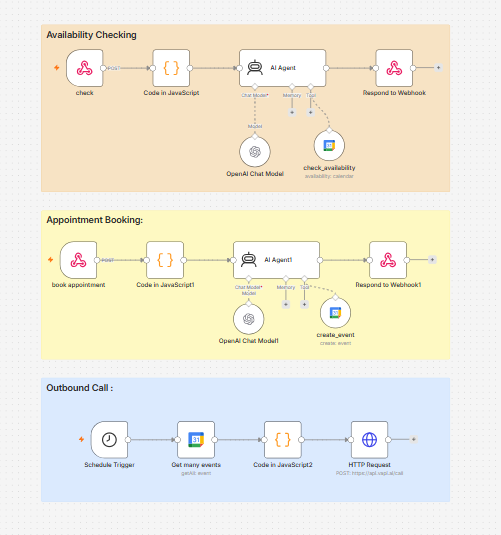

# 🏥 AI Doctor Appointment Scheduling Agent

An AI-powered doctor appointment scheduling system built with **n8n**, **Vapi AI**, **OpenAI GPT-4o Mini**, and **Google Calendar**. The system automates appointment availability checking, booking, and reminder calls through conversational AI.

---

## 🚀 Features

- 🤖 AI-powered virtual receptionist using Vapi + OpenAI
- 📅 Real-time appointment availability checking
- 🩺 Automatic appointment booking in Google Calendar
- 📞 Automated outbound reminder calls before appointments
- 🔗 Webhook-based API integration
- ⚡ Built with low-code automation using n8n
- 🔄 Modular workflows for easy maintenance

---

## 🛠️ Tech Stack

- n8n
- Vapi AI
- OpenAI GPT-4o Mini
- Google Calendar API
- JavaScript

---

## 📸 Workflow



---

## 📂 Project Structure

```
.
├── README.md
├── ShedulingWorkflow.PNG
└── AI_Doctor_Appointment_Scheduling_Agent_Sanitized.json
```

---

## ⚙️ Workflow Overview

The project consists of three main automation workflows:

### 1. Appointment Availability

- Receives appointment requests through a webhook.
- Uses an AI agent to check doctor availability in Google Calendar.
- Suggests the next available time slots if the requested time is unavailable.

### 2. Appointment Booking

- Collects patient information.
- Books the appointment in Google Calendar.
- Confirms the booking through the AI assistant.

### 3. Appointment Reminder

- Runs on a schedule.
- Retrieves upcoming appointments from Google Calendar.
- Initiates an outbound reminder call using Vapi AI.

---

## 🔧 Setup

1. Import `AI_Doctor_Appointment_Scheduling_Agent_Sanitized.json` into n8n.
2. Configure your credentials:
   - OpenAI API
   - Google Calendar OAuth2
   - Vapi API
3. Replace all placeholder IDs with your own values.
4. Activate the workflows.
5. Connect your Vapi assistant to the provided webhook endpoints.

---

## 🔒 Security

The uploaded workflow has been sanitized before publishing.

The following sensitive information has been removed:

- API Keys
- OAuth Credentials
- Calendar IDs
- Assistant IDs
- Phone Number IDs
- Instance IDs
- Webhook IDs

Configure your own credentials inside n8n before running the workflow.

---

## 🎯 Use Cases

- Hospitals
- Private Clinics
- Medical Reception Automation
- Healthcare Appointment Scheduling
- AI Customer Support

